# Central DB Sync — Giải thích toàn bộ Flow trong hệ thống

> Tài liệu này giải thích **từng flow** trong hệ thống Central DB Sync, từ góc nhìn code (Callgraph) đến góc nhìn logic (Flowchart). Phù hợp cho người mới onboarding.

---

## Mục lục

1. [Tổng quan kiến trúc](#1-tổng-quan-kiến-trúc)
2. [Flow 1: Scheduled Sync — Vòng lặp đồng bộ định kỳ](#flow-1-scheduled-sync)
3. [Flow 2: Bootstrap Sync — Đồng bộ toàn bộ bảng (Snapshot)](#flow-2-bootstrap-sync)
4. [Flow 3: Change Tracking Sync — Đồng bộ tăng dần](#flow-3-change-tracking-sync)
5. [Flow 4: Manual Bootstrap Request — Yêu cầu bootstrap từ API](#flow-4-manual-bootstrap-request)
6. [Flow 5: Checkpoint Recovery — CT Invalid → Bootstrap phục hồi](#flow-5-checkpoint-recovery)
7. [Flow 6: Advisory Lock — Kiểm soát đồng thời](#flow-6-advisory-lock)
8. [Flow 7: Mapping & Column Transform — Source → Target](#flow-7-mapping--column-transform)
9. [Flow 8: Orphan Cleanup & Row Lifecycle — Xử lý dòng thừa](#flow-8-orphan-cleanup--row-lifecycle)
10. [Flow 9: Watchdog & Request Reconciliation — Phục hồi crash](#flow-9-watchdog--request-reconciliation)
11. [Bảng tổng hợp Source Mapping](#bảng-tổng-hợp-source-mapping)
12. [Analogy tổng thể](#analogy-tổng-thể)

---

## 1. Tổng quan kiến trúc

### Vấn đề là gì?

Hệ thống ERP (SQL Server) là nơi lưu trữ dữ liệu gốc (master data). Ứng dụng Mobile cần đọc dữ liệu này nhưng **không nên truy cập trực tiếp ERP** vì:
- ERP quá nhạy cảm, cần bảo vệ
- Schema ERP phức tạp, Mobile chỉ cần subset
- Cần tối ưu query cho mobile (PostgreSQL nhanh hơn cho read-heavy workload)

**Giải pháp:** Central DB Sync — một engine chạy nền, **đọc từ SQL Server** và **ghi vào PostgreSQL** theo lịch trình.

### Kiến trúc tổng thể

```text
┌─────────────────────────────────────────────────────────────────┐
│                    HỆ THỐNG CENTRAL DB SYNC                     │
│                                                                 │
│  ┌──────────┐    ┌──────────────┐    ┌───────────────────────┐  │
│  │ Hangfire  │───▶│ SyncOrch.    │───▶│ BootstrapSyncService  │  │
│  │ (Cron)    │    │ ExecuteAsync │    │ ChangeTrackingSvc     │  │
│  └──────────┘    └──────────────┘    └───────────┬───────────┘  │
│                                                  │              │
│         ┌────────────────────────────────────────┼──────┐       │
│         ▼                                        ▼      │       │
│  ┌──────────────┐                       ┌────────────┐  │       │
│  │ SQL Server   │                       │ PostgreSQL  │  │       │
│  │ (ERP)        │                       │ (Central DB)│  │       │
│  │ ──────────── │                       │ ─────────── │  │       │
│  │ CRM.Partners │                       │ report.*    │  │       │
│  │ Configs.*    │    ← Change Tracking   │ ref.*       │  │       │
│  │ Merch.*      │    ← Snapshot          │ sync_meta.* │  │       │
│  └──────────────┘                       └────────────┘  │       │
│                                                         │       │
│  ┌──────────────────────────────────────────────────────┘       │
│  │ Mapping Rules (TableMappingRule)                              │
│  │ ── ColumnMapping: source_col → target_col                    │
│  │ ── ValueTransformer: transform logic                          │
│  │ ── ActivePredicate: xác định active/inactive                   │
│  └──────────────────────────────────────────────────────────────┘
└─────────────────────────────────────────────────────────────────┘
```

### Bảng schema PostgreSQL (sync_meta)

| Bảng | Vai trò |
|---|---|
| `sync_meta.checkpoint` | Theo dõi tiến trình sync mỗi bảng (version, status) |
| `sync_meta.sync_run_log` | Nhật ký chạy (audit trail) — append-only |
| `sync_meta.table_sync_config` | Đăng ký bảng nào được sync, có bật/tắt |
| `sync_meta.bootstrap_request` | Work ticket cho bootstrap thủ công |

### Các trạng thái Checkpoint

| Trạng thái | Ý nghĩa |
|---|---|
| `pending_initial_sync` | Bảng mới, chưa sync lần nào |
| `ready` | Đã sync thành công, sẵn sàng cho incremental |
| `requires_full_resync` | Cần bootstrap lại (checkpoint không hợp lệ) |

---

## Flow 1: Scheduled Sync

### Vấn đề là gì?

Cần một "đồng hồ" chạy định kỳ để gọi sync tất cả các bảng đã đăng ký. Nếu bảng A phụ thuộc bảng B, thì B phải sync xong trước.

### Callgraph — Code perspective

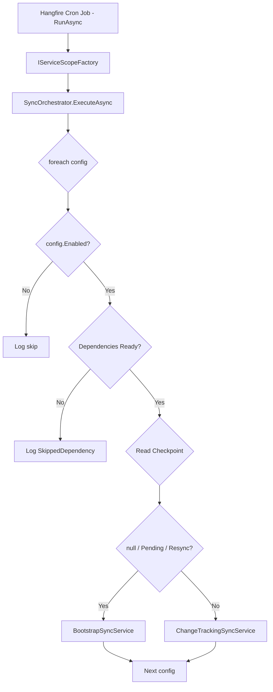

### Flowchart — Logic perspective

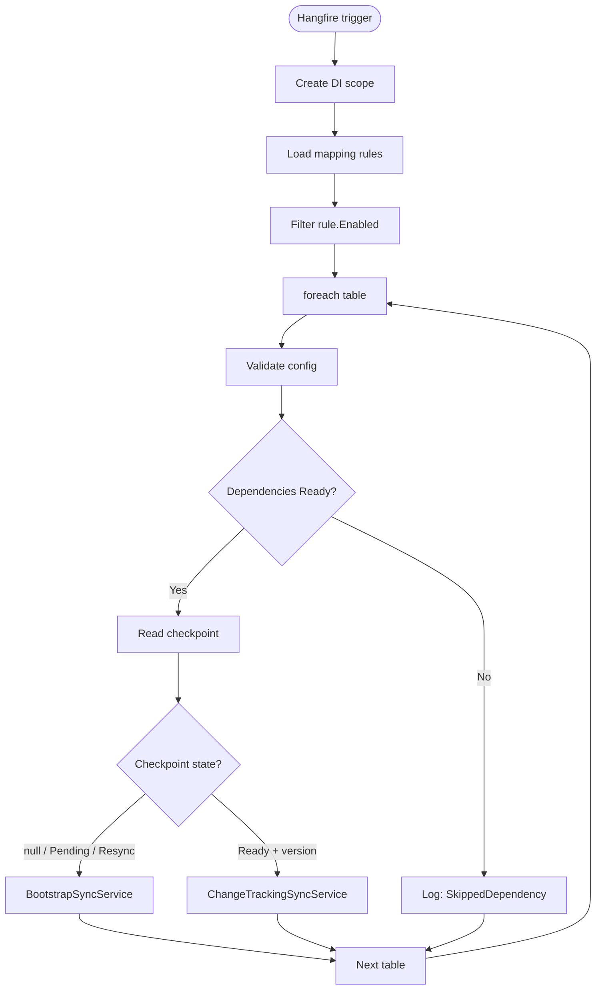

### Code quan trọng

**Entry point — Hangfire job:**
```csharp
// CentralDbSyncJobs.cs:34
[DisableConcurrentExecution(timeoutInSeconds: 60)]
[AutomaticRetry(Attempts = 0)]
public async Task RunAsync(CancellationToken cancellationToken)
{
    using var scope = _scopeFactory.CreateScope();
    var orchestrator = scope.ServiceProvider.GetRequiredService<SyncOrchestrator>();
    var ruleProvider = scope.ServiceProvider.GetRequiredService<IMappingRuleProvider>();

    var configs = ruleProvider.GetAll()
        .Where(rule => rule.Enabled)
        .Select(rule => rule.ToTableSyncConfig())
        .ToArray();

    // Filter by runtime toggle
    var enabled = new List<TableSyncConfig>(configs.Length);
    foreach (var config in configs)
    {
        if (await configStore.IsEnabledAsync(config.SourceTable, cancellationToken))
            enabled.Add(config);
    }

    using var timeoutCts = new CancellationTokenSource(TimeSpan.FromMinutes(5));
    await orchestrator.ExecuteAsync(enabled.ToArray(), linkedCts.Token);
}
```

**Orchestrator — quyết định path:**
```csharp
// SyncOrchestrator.cs:62-74
var checkpoint = await checkpointStore.GetAsync(config.SourceTable, cancellationToken);

SyncRunResult result;
if (checkpoint is null
    || checkpoint.SyncStatus == SyncStatus.CheckpointState.PendingInitialSync
    || checkpoint.SyncStatus == SyncStatus.CheckpointState.RequiresFullResync)
{
    result = await bootstrapService.ExecuteAsync(config, cancellationToken);
}
else
{
    result = await ctService.ExecuteAsync(config, cancellationToken);
}
```

### Bảng ví dụ

| Bảng | Dependency | Checkpoint | Path được chọn |
|---|---|---|---|
| `Partners` | `[]` (không phụ thuộc) | `null` (mới) | **Bootstrap** |
| `Sizes` | `["Units"]` | `ready, v123` | **ChangeTracking** |
| `Units` | `[]` | `ready, v100` | **ChangeTracking** |
| `StyleTrimSwatch` | `["Partners"]` | `Partners chưa ready` | **SkippedDependency** |

### Analogy

> **Như một nhân viên kho kiểm kê hàng tuần:**
> - Mỗi thứ 7 (Hangfire trigger), nhân viên đi kiểm kê
> - Nhìn danh sách hàng cần kiểm (mapping rules)
> - Hàng nào chưa từng kiểm → đếm toàn bộ (Bootstrap)
> - Hàng nào đã kiểm rồi → chỉ kiểm thay đổi (ChangeTracking)
> - Hàng nào phụ thuộc hàng khác chưa xong → đợi lần sau (SkippedDependency)

---

## Flow 2: Bootstrap Sync

### Vấn đề là gì?

Khi một bảng **lần đầu tiên** được sync, hoặc checkpoint bị **invalid** (quá cũ), cần đọc **toàn bộ dữ liệu** từ SQL Server và ghi vào PostgreSQL. Đây gọi là Bootstrap — "khởi động từ đầu".

### Callgraph — Code perspective

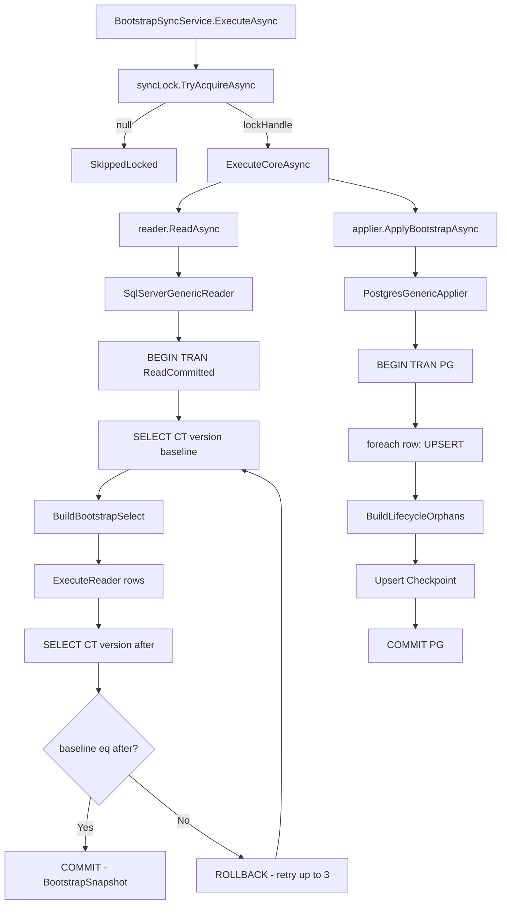

### Flowchart — Logic perspective

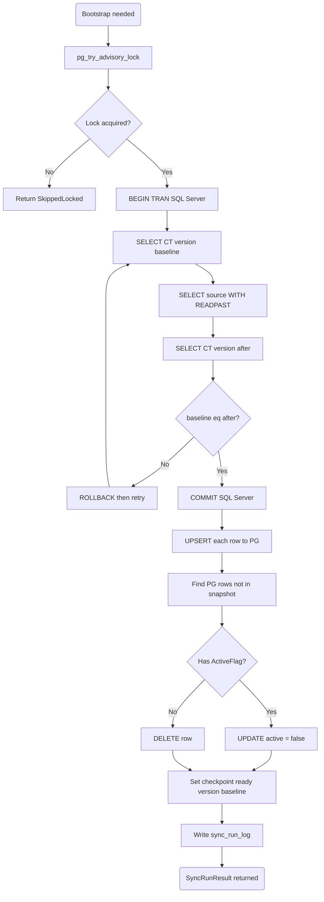

### Code quan trọng

**Snapshot reader — đảm bảo nhất quán:**
```csharp
// SqlServerGenericReader.cs:30-65
for (var attempt = 1; attempt <= MaxBootstrapRetries; attempt++)
{
    await using var tx = (SqlTransaction)await conn.BeginTransactionAsync(
        IsolationLevel.ReadCommitted, ct);

    var baseline = await conn.ExecuteScalarAsync<long>(
        "SELECT CHANGE_TRACKING_CURRENT_VERSION()", transaction: tx);

    var select = sqlBuilder.BuildBootstrapSelect(rule);
    var rows = await ReadRowsAsync(conn, tx, select, ct);

    var versionAfter = await conn.ExecuteScalarAsync<long>(
        "SELECT CHANGE_TRACKING_CURRENT_VERSION()", transaction: tx);

    if (baseline == versionAfter)
    {
        await tx.CommitAsync(ct);
        return new BootstrapSnapshot(baseline, rows);
    }

    await tx.RollbackAsync(ct);  // Version drifted → retry
}
```

**Applier — UPSERT + orphan cleanup trong 1 transaction:**
```csharp
// PostgresGenericApplier.cs:134-181
await using var tx = await conn.BeginTransactionAsync(ct);

// Bước 1: UPSERT tất cả rows từ snapshot
foreach (var row in snapshot.Rows)
{
    var values = BuildTargetValues(rule, row);
    snapshotPrimaryKeys.Add(values[targetPrimaryKey.TargetColumn]);
    await conn.ExecuteAsync(upsertSql, ToDynamicParameters(values), transaction: tx);
}

// Bước 2: Deactivate/delete orphans (rows trong PG không có trong snapshot)
var orphanLifecycleCount = await conn.ExecuteAsync(
    sqlBuilder.BuildLifecycleOrphans(rule, "sourceSystem"),
    new { sourceSystem = rule.OwnershipScope, snapshotPks },
    transaction: tx);

// Bước 3: Upsert checkpoint → status = 'ready'
await conn.ExecuteAsync(
    @"INSERT INTO sync_meta.checkpoint (...)
      ON CONFLICT (source_table) DO UPDATE SET ...",
    new { baselineVersion = snapshot.BaselineVersion, ... },
    transaction: tx);

await tx.CommitAsync(ct);
```

### Bảng ví dụ: UPSERT

| Cột source (SQL Server) | Mapping | Cột target (PostgreSQL) |
|---|---|---|
| `PartnerId` | `IsPrimaryKey = true` | `partner_id` |
| `CompanyId` | `SourceColumn = "CompanyId"` | `company_id` |
| `PartnerCode` | `SourceColumn = "PartnerCode"` | `code` |
| `PartnerName` | `SourceColumn = "PartnerName"` | `name` |
| `IsCustomer` | `SourceColumn = "IsCustomer"` | `is_customer` |
| — | `IsActiveFlag = true` | `is_active` (tính từ ActivePredicate) |
| — | Auto-generated | `source_system = 'erp'` |
| — | Auto-generated | `synced_at = NOW()` |

### Analogy

> **Như chuyển nhà — đếm toàn bộ đồ:**
> 1. **Khóa cửa kho cũ** (Advisory Lock) — không cho ai vào sửa đồ trong lúc đếm
> 2. **Đếm tất cả đồ** trong kho cũ (SELECT * FROM source) — ghi lại version "lần đếm thứ N"
> 3. **Kiểm tra lại version** — nếu có người khác vừa sửa đồ → đếm lại (retry)
> 4. **Mang đồ sang nhà mới** (UPSERT vào PostgreSQL) — đồ đã có thì ghi đè
> 5. **Dọn đồ thừa** trong nhà mới mà kho cũ không có (Orphan Cleanup)
> 6. **Ghi sổ**: "Đã chuyển xong, version = N" (Save Checkpoint)
> 7. **Mở khóa cửa kho** (Release Lock)

---

## Flow 3: Change Tracking Sync

### Vấn đề là gì?

Bootstrap rất tốn tài nguyên (đọc toàn bộ bảng). Sau lần đầu, chỉ cần đọc **những thay đổi** từ lần sync trước. SQL Server Change Tracking cung cấp chính xác điều này.

### Callgraph — Code perspective

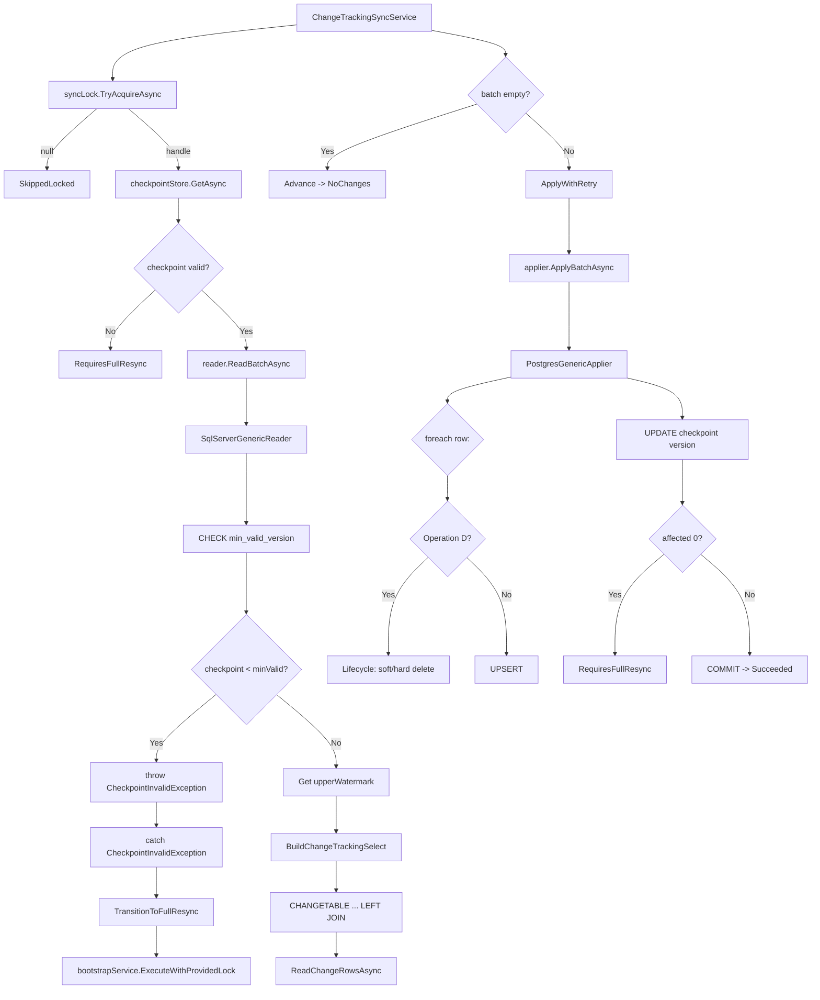

### Flowchart — Logic perspective

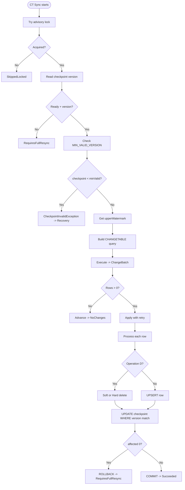

### Code quan trọng

**Change Tracking SELECT:**
```csharp
// SqlServerSqlBuilder.cs:27-61
public SelectSql BuildChangeTrackingSelect(TableMappingRule rule)
{
    var sql = $@"
SELECT CT.SYS_CHANGE_OPERATION, CT.SYS_CHANGE_VERSION,
       CT.{pk} AS __ct_pk_0,
       t0.Col1, t0.Col2, ...
FROM CHANGETABLE(CHANGES [dbo].[SourceTable], @checkpoint) AS CT
LEFT JOIN [dbo].[SourceTable] AS [t0] WITH (READPAST)
    ON t0.Id = CT.Id
WHERE CT.SYS_CHANGE_VERSION <= @upperWatermark
ORDER BY CT.SYS_CHANGE_VERSION, CT.Id";
    return new SelectSql(sql, aliases, parameters);
}
```

**Retry logic cho transient errors:**
```csharp
// ChangeTrackingSyncService.cs:206-260
private async Task<SyncRunResult> ApplyWithRetryAsync(...)
{
    for (var attempt = 1; attempt <= MaxApplyRetries; attempt++)
    {
        try { return await applier.ApplyBatchAsync(config, batch, ct); }
        catch (Exception ex) when (attempt < MaxApplyRetries && IsTransient(ex))
        {
            await Task.Delay(TimeSpan.FromSeconds(Math.Pow(2, attempt - 1)), ct);
            // Exponential backoff: 1s, 2s, 4s
        }
    }
}

private static bool IsTransient(Exception ex)
{
    var message = ex.Message;
    return message.Contains("deadlock", StringComparison.OrdinalIgnoreCase)
        || message.Contains("timeout", StringComparison.OrdinalIgnoreCase)
        || message.Contains("connection", StringComparison.OrdinalIgnoreCase);
}
```

### Bảng ví dụ: Change Tracking operations

| SYS_CHANGE_OPERATION | Ý nghĩa | Action trong Applier |
|---|---|---|
| `I` (Insert) | Hàng mới được thêm | UPSERT vào PG |
| `U` (Update) | Hàng đã được sửa | UPSERT vào PG (ghi đè) |
| `D` (Delete) | Hàng đã bị xóa | Soft-delete hoặc Hard-delete |

### Analogy

> **Như kiểm kê hàng tồn kho hàng ngày:**
> - Thay vì đếm lại **tất cả** hàng (Bootstrap), chỉ kiểm **phiếu nhập/xuất** từ hôm qua
> - `CHANGETABLE(CHANGES, @checkpoint)` = "Cho tôi xem mọi thay đổi từ phiên bản N"
> - `I` = Hàng mới nhập → thêm vào sổ
> - `U` = Hàng bị sửa → cập nhật sổ
> - `D` = Hàng xuất kho → đánh dấu đã xóa hoặc deactivate
> - Nếu phiếu ghi version quá cũ (< MIN_VALID_VERSION) → phải đếm lại toàn bộ (Recovery)

---

## Flow 4: Manual Bootstrap Request

### Vấn đề là gì?

Ngoài sync định kỳ, đôi khi cần **trigger bootstrap thủ công** cho một bảng cụ thể (ví dụ: bảng mới thêm, data bị lỗi cần reload). Cần một API endpoint + work ticket system để quản lý.

### Callgraph — Code perspective

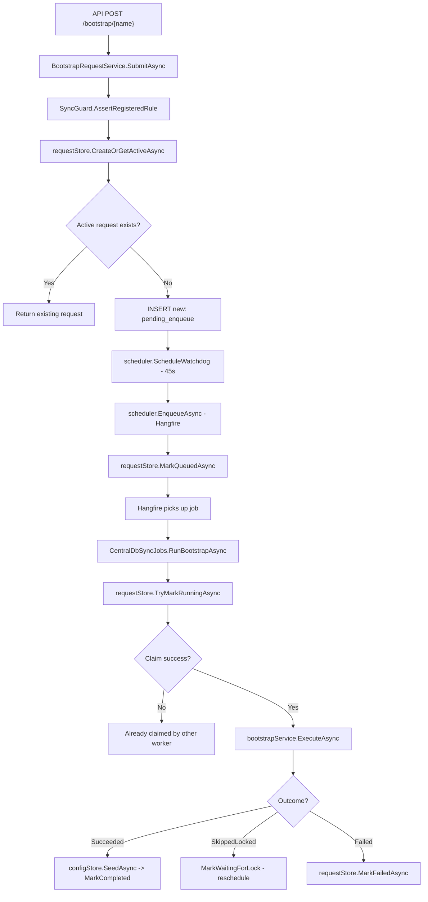

### Flowchart — Logic perspective

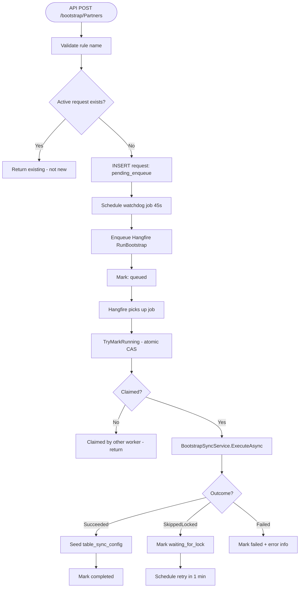

### Code quan trọng

**Tạo hoặc lấy request hiện tại (idempotent):**
```csharp
// PostgresBootstrapRequestStore.cs:13-98
var actualRequestId = await conn.QuerySingleAsync<Guid>(@"
    INSERT INTO sync_meta.bootstrap_request
        (request_id, source_table, status, ...)
    VALUES (@RequestId, @SourceTable, 'pending_enqueue', ...)
    ON CONFLICT (source_table)
        WHERE status IN ('pending_enqueue', 'queued', 'running', 'waiting_for_lock')
    DO UPDATE SET updated_at = EXCLUDED.updated_at
    RETURNING request_id",
    new { RequestId = requestId, SourceTable = sourceTable, ... });

if (actualRequestId == requestId)
{
    // Mình insert thành công → request mới
    return new BootstrapRequestResult(created, IsNewRequest: true);
}
// Conflict → trả request đã tồn tại
```

**Hangfire job claim và lifecycle:**
```csharp
// CentralDbSyncJobs.cs:72-140
public async Task RunBootstrapAsync(string sourceTable, Guid requestId)
{
    var claimed = await requestStore.TryMarkRunningAsync(requestId, ct);
    if (!claimed) return;  // Worker khác đã claim

    var result = await bootstrapService.ExecuteAsync(config, requestId, cts.Token);

    switch (result.Outcome)
    {
        case SyncStatus.Outcome.Succeeded:
            await configStore.SeedAsync(config, ct);  // Đăng ký cho cron
            await requestStore.MarkCompletedAsync(requestId, ct);
            break;
        case SyncStatus.Outcome.SkippedLocked:
            // Reschedule sau 1 phút
            var newJobId = await scheduler.ScheduleAsync(
                sourceTable, requestId, TimeSpan.FromMinutes(1), ct);
            await requestStore.MarkQueuedAsync(requestId, newJobId, ct);
            break;
        default:
            await requestStore.MarkFailedAsync(requestId, errorCode, errorMsg, ct);
            break;
    }
}
```

### State Machine cho Bootstrap Request

```text
pending_enqueue -> queued -> running -> completed
                     ^        |
                     |        +-- waiting_for_lock -> queued (retry)
                     |        +-- failed
                     |
                     +-- failed (enqueue error)
```

### Analogy

> **Như đặt hàng online:**
> 1. **Đặt hàng** (SubmitAsync) — tạo phiếu đặt, kiểm tra đã có phiếu chưa
> 2. **Hẹn nhắc** (Watchdog 45s) — nếu quên xử lý, nhắc lại
> 3. **Shipper nhận** (Hangfire enqueue) — giao cho nhân viên kho
> 4. **Nhân viên kho claim** (TryMarkRunning) — "tôi sẽ xử lý phiếu này"
> 5. **Đóng gói + gửi** (BootstrapSyncService) — thực hiện đồng bộ
> 6. **Giao thành công** → đăng ký bảng vào lịch định kỳ (SeedAsync)
> 7. **Kho đang bận** → đợi 1 phút, thử lại (WaitingForLock)

---

## Flow 5: Checkpoint Recovery

### Vấn đề là gì?

Khi Change Tracking phát hiện checkpoint hiện tại **quá cũ** (dưới `MIN_VALID_VERSION`), dữ liệu incremental không còn đáng tin cậy. Cần **tự động chuyển sang Bootstrap** để khôi phục.

### Callgraph — Code perspective

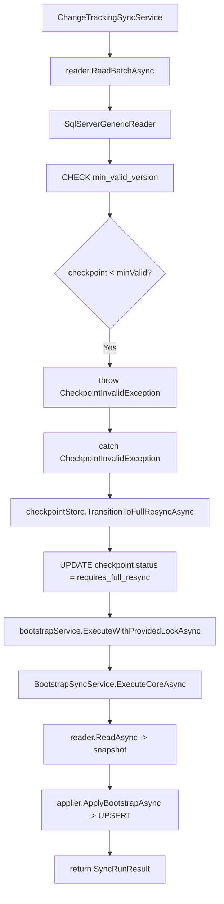

### Flowchart — Logic perspective

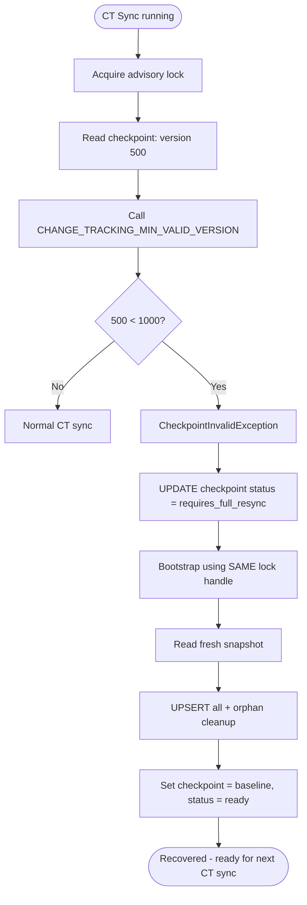

### Code quan trọng

**Recovery chạy dưới cùng lock (không release):**
```csharp
// ChangeTrackingSyncService.cs:89-107
catch (CheckpointInvalidException)
{
    logger.LogWarning("Checkpoint invalid for {SourceTable}: " +
        "transitioning and running immediate bootstrap recovery", ...);

    await checkpointStore.TransitionToFullResyncAsync(
        config.SourceTable, "CheckpointInvalid",
        "CT checkpoint is below minimum valid version", cancellationToken);

    // QUAN TRỌNG: Bootstrap chạy dưới cùng lock —
    // KHÔNG release và re-acquire, vì worker khác có thể steal lock
    return await bootstrapService.ExecuteWithProvidedLockAsync(
        config, Guid.NewGuid(), startedAt, cancellationToken);
}
```

### Tại sao không release lock?

```text
NẾU release lock trước khi bootstrap:
  Worker A: CT sync -> checkpoint invalid -> RELEASE LOCK
  Worker B:                          ACQUIRE LOCK -> bootstrap (bắt đầu lại)
  Worker A:                          ACQUIRE LOCK (chờ B xong) -> bootstrap lại (lãng phí!)

GIẢI PHÁP: Worker A giữ lock, tự bootstrap -> an toàn, không lãng phí.
```

### Analogy

> **Như phát hiện sổ kiểm kê quá cũ:**
> - Bạn đang kiểm kê hàng theo **phiếu xuất nhập** (Change Tracking)
> - Nhưng phát hiện: "Phiếu từ phiên bản 500, mà hệ thống chỉ còn lưu từ phiên bản 1000!"
> - Không thể tin phiếu cũ → phải **đếm lại toàn bộ** (Bootstrap)
> - Quan trọng: **KHÔNG rời khỏi kho** giữa chừng (giữ lock) — kẻo người khác vào đếm trùng

---

## Flow 6: Advisory Lock

### Vấn đề là gì?

Nhiều worker/process có thể chạy cùng lúc (nhiều instance app, nhiều Hangfire server). Cần đảm bảo **chỉ 1 worker** sync một bảng tại một thời điểm, tránh duplicate và conflict.

### Callgraph — Code perspective

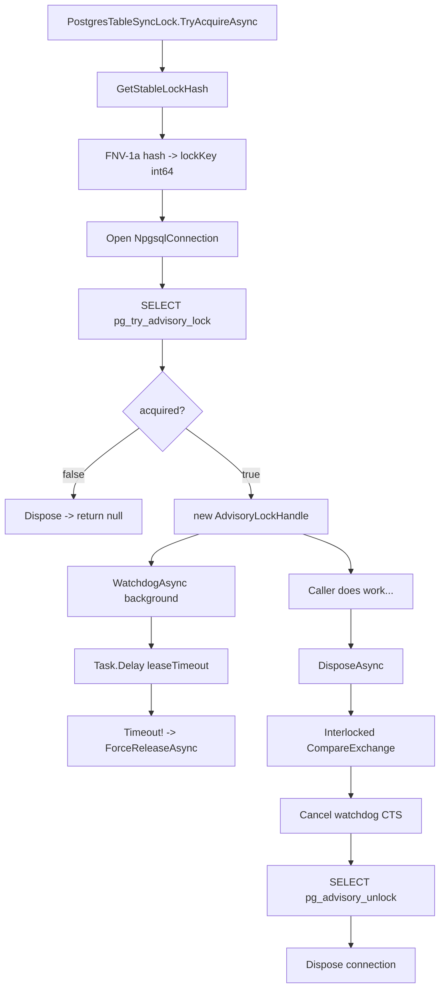

### Flowchart — Logic perspective

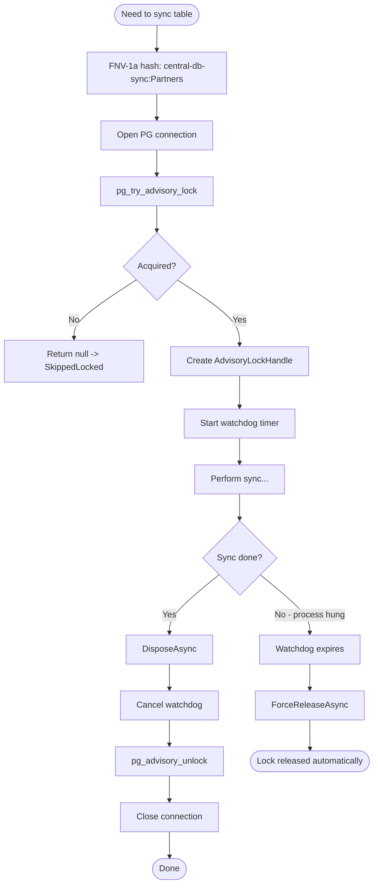

### Code quan trọng

**Lock hash — deterministic, ổn định:**
```csharp
// PostgresTableSyncLock.cs:45-58
private static long GetStableLockHash(string key)
{
    unchecked
    {
        ulong hash = 14695981039346656037;  // FNV offset basis
        foreach (var c in key)
        {
            hash ^= c;
            hash *= 1099511628211;           // FNV prime
        }
        return (long)hash;
    }
}
```

**Watchdog — force release nếu process treo:**
```csharp
// PostgresTableSyncLock.cs:84-96
private async Task WatchdogAsync(TimeSpan leaseTimeout, CancellationToken ct)
{
    try
    {
        await Task.Delay(leaseTimeout, ct);
        // Timeout — caller never disposed (hung) → force release
        await ForceReleaseAsync();
    }
    catch (OperationCanceledException)
    {
        // Happy-path: DisposeAsync cancelled the watchdog
    }
}
```

**Thread-safe release (chỉ 1 thread pass):**
```csharp
// PostgresTableSyncLock.cs:103-122
public async ValueTask DisposeAsync()
{
    if (Interlocked.CompareExchange(ref _disposed, 1, 0) != 0)
        return;  // Already released by watchdog or another thread

    try { _watchdogCts.Cancel(); } catch (ObjectDisposedException) { }
    await _connection.ExecuteAsync("SELECT pg_advisory_unlock(@lockKey)", ...);
    await _connection.DisposeAsync();
}
```

### Lock timeout cho từng flow

| Flow | Lease timeout |
|---|---|
| Bootstrap Sync | 12 phút |
| Change Tracking Sync | 7 phút |

### Analogy

> **Như nhà vệ sinh công cộng có khóa + hẹn giờ:**
> 1. **Hash key** = Số phòng (luôn cùng số cho cùng 1 phòng)
> 2. **pg_try_advisory_lock** = Thử mở cửa — nếu có người trong đó → quay lại sau
> 3. **Đang sử dụng** = Bên trong làm việc
> 4. **Watchdog (12 phút)** = Nếu bạn ở trong quá lâu (treo), hệ thống tự mở cửa
> 5. **DisposeAsync** = Xong việc, mở khóa bình thường
> 6. **Interlocked** = Đảm bảo chỉ 1 người mở khóa (không 2 người cùng mở)

---

## Flow 7: Mapping & Column Transform

### Vấn đề là gì?

Schema SQL Server và PostgreSQL **không giống nhau**. Cần một hệ thống mapping linh hoạt:
- Đổi tên cột (`PartnerId` → `partner_id`)
- Transform giá trị (`IsCustomer` → `is_active`)
- Computed columns (expression-based)
- Join bảng phụ để lấy lookup data

### Callgraph — Code perspective

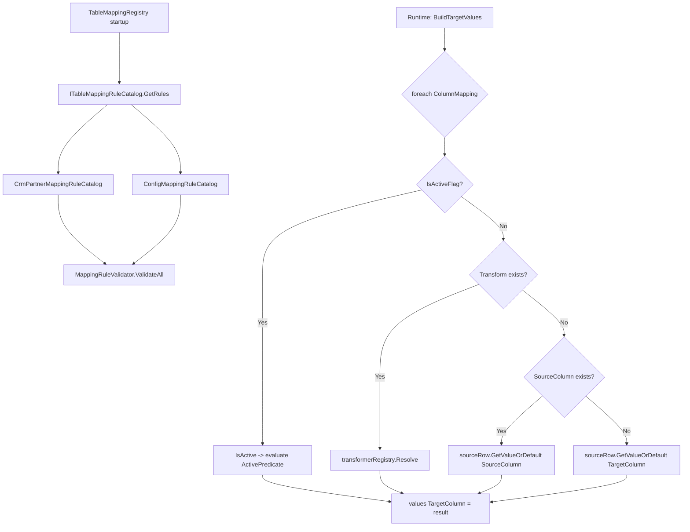

### Flowchart — Logic perspective

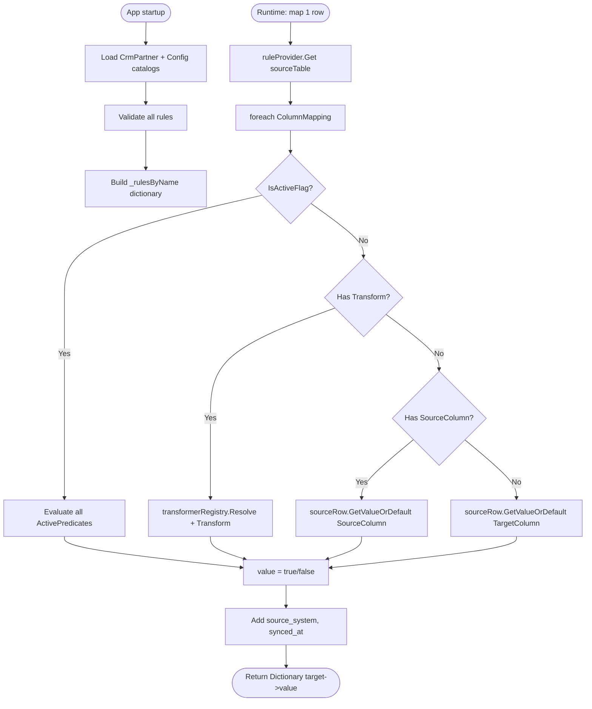

### Code quan trọng

**Column mapping resolution:**
```csharp
// PostgresGenericApplier.cs:218-228
private object? ResolveColumnValue(TableMappingRule rule, ColumnMapping column, GenericSourceRow sourceRow)
{
    if (column.IsActiveFlag)
        return IsActive(rule, sourceRow);                    // 1. Active flag → evaluate predicates
    if (!string.IsNullOrWhiteSpace(column.Transform))
        return transformerRegistry.Resolve(column.Transform) // 2. Custom transform
            .Transform(sourceRow.Values);
    if (!string.IsNullOrWhiteSpace(column.SourceColumn))
        return sourceRow.GetValueOrDefault(column.SourceColumn); // 3. Direct column map
    return sourceRow.GetValueOrDefault(column.TargetColumn);     // 4. Same-name fallback
}
```

**Active predicate evaluation (AND logic):**
```csharp
// PostgresGenericApplier.cs:230-255
private static bool IsActive(TableMappingRule rule, GenericSourceRow sourceRow)
{
    if (rule.Source.ActivePredicate.Count == 0) return true;  // Empty = all active
    return rule.Source.ActivePredicate.All(predicate => Evaluate(predicate, sourceRow));
}

private static bool Evaluate(ColumnPredicate predicate, GenericSourceRow sourceRow)
{
    var actual = sourceRow.GetValueOrDefault(predicate.Column);
    return predicate.Operator switch
    {
        PredicateOperator.Eq    => Equals(actual, predicate.Value),
        PredicateOperator.Neq   => !Equals(actual, predicate.Value),
        PredicateOperator.In    => AsEnumerable(predicate.Value).Contains(actual),
        PredicateOperator.IsNull => actual is null,
        // ... và nhiều operator khác
    };
}
```

### Bảng ví dụ: Mapping Rule cho Partners

| Target Column | Target Type | Source Column | Is PK | IsActiveFlag | Notes |
|---|---|---|---|---|---|
| `partner_id` | `integer` | `PartnerId` | ✅ | | Primary key |
| `company_id` | `integer` | `CompanyId` | | | |
| `code` | `text` | `PartnerCode` | | | |
| `name` | `text` | `PartnerName` | | | |
| `is_customer` | `boolean` | `IsCustomer` | | | |
| `is_supplier` | `boolean` | `IsSupplier` | | | |
| `is_active` | `boolean` | — | | ✅ | Tính từ ActivePredicate |
| `source_system` | `text` | — | | | Auto = 'erp' |
| `synced_at` | `timestamptz` | — | | | Auto = NOW() |

### Analogy

> **Như dịch thuật tài liệu:**
> - **SourceSpec** = Tài liệu gốc (tiếng Anh)
> - **TargetSpec** = Bản dịch (tiếng Việt)
> - **ColumnMapping** = Từ điển: "PartnerId" → "partner_id"
> - **IsActiveFlag** = "Từ này có nghĩa tích cực không?" → true/false
> - **Transform** = "Dịch đặc biệt" (ví dụ: đổi format ngày)
> - **ActivePredicate** = Quy tắc xác định "từ này có hoạt động không"

---

## Flow 8: Orphan Cleanup & Row Lifecycle

### Vấn đề là gì?

Khi sync, cần xử lý 2 trường hợp "hàng thừa":
1. **Bootstrap Orphan**: Hàng tồn tại trong PG nhưng **không có trong source** anymore
2. **CT Delete**: Source báo hàng đã bị xóa (`SYS_CHANGE_OPERATION = 'D'`)

### Callgraph — Code perspective

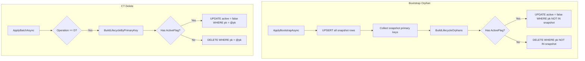

### Flowchart — Logic perspective

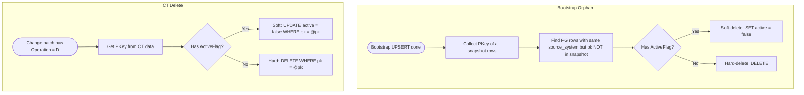

### Code quan trọng

**BuildLifecycleOrphans — tìm rows thừa trong PG:**
```csharp
// UpsertSqlBuilder.cs:94-113
public string BuildLifecycleOrphans(TableMappingRule rule, string sourceSystemParameterName)
{
    var pk = rule.Target.PrimaryKey[0];
    var whereClause = $@"""source_system"" = @{sourceSystemParameterName}
  AND ""{pk}"" <> ALL(@snapshotPks)";

    if (TryGetActiveFlagColumn(rule, out var activeFlagColumn))
    {
        // Soft-delete: đánh dấu inactive
        return $@"UPDATE {table}
SET ""{activeFlagColumn}"" = false, ""synced_at"" = NOW()
WHERE {whereClause}";
    }

    // Hard-delete: xóa hẳn
    return $@"DELETE FROM {table} WHERE {whereClause}";
}
```

**BuildLifecycleByPrimaryKey — xóa 1 row cụ thể:**
```csharp
// UpsertSqlBuilder.cs:68-92
public string BuildLifecycleByPrimaryKey(TableMappingRule rule)
{
    var predicates = rule.Target.PrimaryKey
        .Select(pk => $"""{pk}"" = @{pk}"");
    var whereClause = string.Join(" AND ", predicates);

    if (TryGetActiveFlagColumn(rule, out var activeFlagColumn))
    {
        return $@"UPDATE {table}
SET ""{activeFlagColumn}"" = false, ""synced_at"" = NOW()
WHERE {whereClause}";
    }

    return $@"DELETE FROM {table} WHERE {whereClause}";
}
```

### So sánh 2 cách lifecycle

| Tiêu chí | By PrimaryKey (CT Delete) | By Orphan (Bootstrap) |
|---|---|---|
| **Khi nào dùng** | CT báo `Operation = 'D'` | Bootstrap: row trong PG không trong snapshot |
| **Xác định target** | Chính xác 1 row theo PK | Nhiều rows: `WHERE pk <> ALL(snapshotPks)` |
| **Scope** | Không cần `source_system` | Cần `source_system` để tránh xóa nhầm data từ nguồn khác |
| **Use case** | Source xóa row | Source xóa row nhưng CT miss, hoặc data drift |

### Analogy

> **Như dọn kho hàng:**
> - **CT Delete** = Nhận được phiếu "Hàng #123 đã xuất kho" → đánh dấu/xóa chính xác hàng #123
> - **Bootstrap Orphan** = So sánh danh sách hàng mới nhất với hàng trong kho → hàng nào **không có trong danh sách mới** → dọn ra
> - **Soft-delete** (có `is_active`) = Đánh dấu "ngưng bán" nhưng giữ hàng trong kho (phục vụ FK)
> - **Hard-delete** (không `is_active`) = Vứt hẳn khỏi kho

---

## Flow 9: Watchdog & Request Reconciliation

### Vấn đề là gì?

Khi submit bootstrap request, có thể **process crash** giữa lúc tạo request (`pending_enqueue`) và enqueue Hangfire job. Cần cơ chế **tự động phát hiện và khôi phục** orphan requests.

### Callgraph — Code perspective

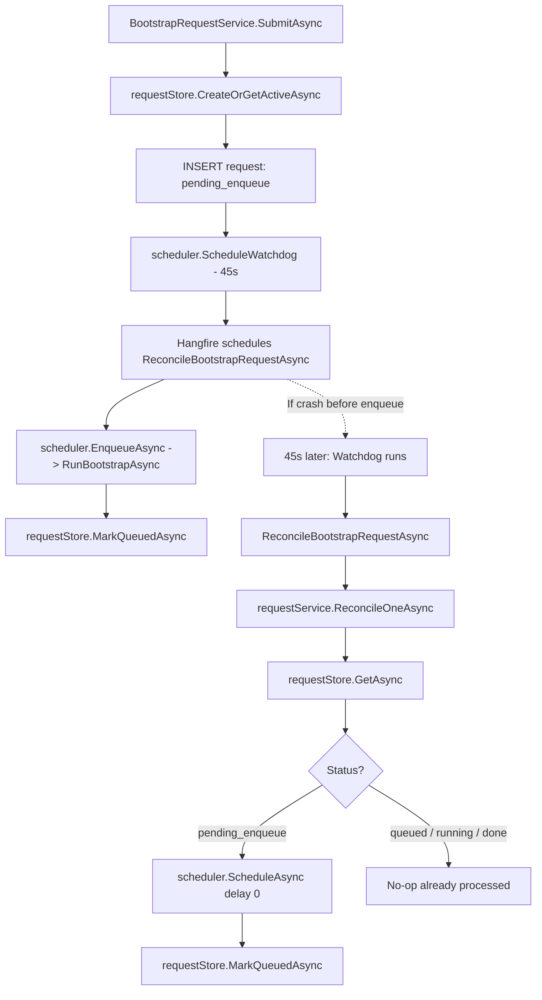

### Flowchart — Logic perspective

```mermaid
flowchart TD
    subgraph Happy Path
        S1["SubmitAsync"] --> S2["Create: pending_enqueue"]
        S2 --> S3["Schedule watchdog: 45s"]
        S3 --> S4["Enqueue Hangfire job"]
        S4 --> S5["Mark: queued"]
        S5 --> S6["45s later: watchdog runs"]
        S6 --> S7{"Status?"}
        S7 -->|"queued"| S8["No-op = Happy!"]
    end

    subgraph Crash Path
        C1["SubmitAsync"] --> C2["Create: pending_enqueue"]
        C2 --> C3["Schedule watchdog: 45s"]
        C3 --> C4["* CRASH before enqueue!"]
        C4 --> C5["45s later: watchdog runs"]
        C5 --> C6{"Status?"}
        C6 -->|"pending_enqueue"| C7["Schedule job immediately, delay 0"]
        C7 --> C8["Mark: queued"]
    end
```

### Code quan trọng

**Watchdog logic:**
```csharp
// BootstrapRequestService.cs:94-150
public async Task ReconcileOneAsync(string ruleName, Guid requestId, CancellationToken ct)
{
    var request = await requestStore.GetAsync(requestId, ct);
    if (request is null) return;  // Request đã bị xóa

    if (request.Status != BootstrapRequestStatus.PendingEnqueue)
        return;  // Đã được xử lý bởi Hangfire hoặc watchdog trước

    // Re-enqueue ngay lập tức
    var hangfireJobId = await scheduler.ScheduleAsync(
        ruleName, requestId, TimeSpan.Zero, ct);

    await requestStore.MarkQueuedAsync(requestId, hangfireJobId, ct);
    logger.LogInformation("Watchdog reconciled orphan pending request {RequestId}", requestId);
}
```

**Partial unique index — chỉ cho phép 1 active request per table:**
```sql
-- 001-central-db-sync-schema.sql:209-211
CREATE UNIQUE INDEX ux_bootstrap_request_active_table
    ON sync_meta.bootstrap_request (source_table)
    WHERE status IN ('pending_enqueue', 'queued', 'running', 'waiting_for_lock');
```

### Timeline minh họa

```text
T+0s   SubmitAsync: INSERT request (pending_enqueue)
T+0s   ScheduleWatchdog (45s delay)
T+0s   --- CRASH ---
T+45s  Watchdog: ReconcileOneAsync
T+45s  Status = pending_enqueue -> Schedule job ngay
T+45s  Mark queued -> Hangfire chạy bootstrap
T+46s  RunBootstrapAsync -> claim -> chạy bootstrap thành công
```

### Analogy

> **Như hẹn giờ nhắc việc:**
> 1. Bạn đặt lịch hẹn (CreateRequest) + đặt báo thức 45 phút
> 2. Bình thường: Bạn gửi email ngay (Enqueue) → khi báo thức reo → thấy đã gửi rồi → tắt báo thức
> 3. Crash: Bạn **ngủ quên** trước khi gửi email → 45 phút sau báo thức reo → phát hiện chưa gửi → **gửi ngay**
> 4. Partial Index = Chỉ cho phép 1 lịch hẹn active/bảng — tránh tạo trùng

---

## Bảng tổng hợp Source Mapping

| File | Vai trò |
|---|---|
| `Application/.../Services/SyncOrchestrator.cs` | **Bộ điều phối chính** — duyệt bảng, kiểm tra dependency, quyết định Bootstrap hay CT |
| `Application/.../Services/BootstrapSyncService.cs` | **Bootstrap logic** — snapshot + apply + orphan cleanup |
| `Application/.../Services/ChangeTrackingSyncService.cs` | **CT logic** — đọc changes + apply + retry + recovery |
| `Application/.../Services/BootstrapRequestService.cs` | **Request management** — submit + status + watchdog reconcile |
| `Application/.../Models/SyncStatus.cs` | **Enum definitions** — Outcomes + CheckpointStates |
| `Application/.../Models/BootstrapSnapshot.cs` | **Snapshot data** — BaselineVersion + all rows |
| `Application/.../Models/ChangeBatch.cs` | **Change data** — PreviousCheckpoint + UpperWatermark + rows |
| `Application/.../Models/BootstrapRequest.cs` | **Request model** — status machine + lifecycle |
| `Application/.../Mapping/TableMappingRule.cs` | **Mapping definition** — Source + Target + Columns |
| `Application/.../Mapping/ColumnMapping.cs` | **Column map** — source→target + transform + PK + ActiveFlag |
| `Application/.../Mapping/SourceSpec.cs` | **Source spec** — table, alias, joins, filters, predicates |
| `Application/.../Mapping/TargetSpec.cs` | **Target spec** — schema, table, primary keys |
| `Application/.../Config/TableMappingRegistry.cs` | **Registry** — load + validate + lookup rules |
| `Application/.../Validation/SyncGuard.cs` | **Guards** — validate enum values, rule existence |
| `Infrastructure/.../SqlServerGenericReader.cs` | **SQL Server reader** — implements IBootstrapSnapshotReader + IChangeTrackingReader |
| `Infrastructure/.../PostgresGenericApplier.cs` | **PostgreSQL applier** — UPSERT + lifecycle + orphan cleanup |
| `Infrastructure/.../PostgresTableSyncLock.cs` | **Advisory lock** — pg_try_advisory_lock + watchdog |
| `Infrastructure/.../PostgresSyncCheckpointStore.cs` | **Checkpoint store** — get, advance, transition |
| `Infrastructure/.../PostgresBootstrapRequestStore.cs` | **Request store** — CRUD + state transitions |
| `Infrastructure/.../PostgresSyncConfigStore.cs` | **Config store** — seed + enable/disable toggle |
| `Infrastructure/.../PostgresSyncRunLog.cs` | **Run log** — append-only audit trail |
| `Infrastructure/.../HangfireBootstrapJobScheduler.cs` | **Hangfire bridge** — enqueue/schedule bootstrap jobs |
| `Infrastructure/.../CentralDbSyncJobs.cs` | **Hangfire jobs** — RunAsync, RunBootstrapAsync, Reconcile |
| `Infrastructure/.../Sql/SqlServerSqlBuilder.cs` | **SQL Server SQL** — BuildBootstrapSelect + BuildChangeTrackingSelect |
| `Infrastructure/.../Sql/UpsertSqlBuilder.cs` | **PostgreSQL SQL** — BuildUpsert + BuildLifecycle* |
| `Infrastructure/.../Sql/PredicateSqlBuilder.cs` | **WHERE clause** — build parameterized predicates |
| `Infrastructure/.../CentralDbSyncInfrastructureExtensions.cs` | **DI setup** — register all services |
| `Infrastructure/Database/SqlScript/CentralDbSync/001-*.sql` | **Schema DDL** — tables, indexes, constraints |

---

## Analogy tổng thể

### "Nhà phân phối hàng hóa" — mapping toàn bộ hệ thống

| Thành phần hệ thống | Analogy |
|---|---|
| **SQL Server (ERP)** | Nhà máy sản xuất — nguồn gốc hàng hóa |
| **PostgreSQL (Central DB)** | Kho trung chuyển — cung cấp cho cửa hàng (Mobile) |
| **Hangfire Cron** | Lịch giao hàng cố định (mỗi N phút) |
| **SyncOrchestrator** | Quản lý kho — quyết định kiểm kê hay kiểm tra thay đổi |
| **BootstrapSyncService** | Kiểm kê toàn bộ — đếm lại từ đầu |
| **ChangeTrackingSyncService** | Kiểm tra phiếu xuất nhập — chỉ xem thay đổi |
| **PostgresGenericApplier** | Nhân viên bốc xếp — mang hàng sang kho mới |
| **Advisory Lock** | Chìa khóa kho — chỉ 1 người vào 1 lúc |
| **Watchdog (12 phút)** | Hẹn giờ an toàn — nếu treo quá lâu thì mở cửa |
| **Checkpoint** | Sổ kiểm kê — ghi lại "lần cuối kiểm kê version N" |
| **Mapping Rules** | Bảng mã hàng — "Mã A ở nhà máy" = "Mã X ở kho" |
| **Orphan Cleanup** | Dọn hàng thừa — hàng trong kho nhưng nhà máy không còn sản xuất |
| **Watchdog (45s)** | Nhắc việc — "Bạn chưa gửi hàng, gửi ngay đi!" |
| **Bootstrap Request** | Phiếu đặt hàng — "Kiểm kê lại toàn bộ bảng Partners" |
| **SyncGuard** | Kiểm tra chất lượng — mọi giá trị phải đúng định dạng |
| **Run Log** | Nhật ký — ghi lại mọi lần kiểm kê, ai làm, kết quả gì |

---

> **Tài liệu được tạo tự động dựa trên codebase thực tế — 2026-07-23**
> Branch: `dev-2026/replicate-db/hung-nt`
